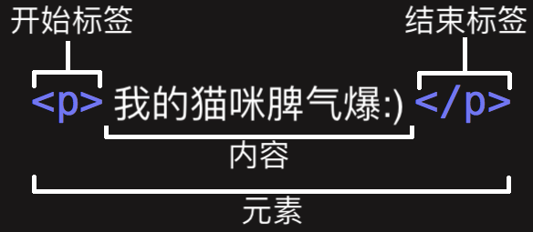
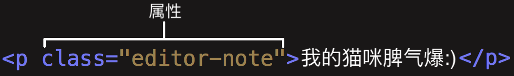

# lesson1（上）
html、css

---
- html
超文本标记语言，HyperText Markup Language缩写形式

- css
层叠样式表，Cascading Style Sheets缩写形式，是设计网页样式的语言

---
## HTML
HTML结构
（使用IDE快捷生成：空的html写入!或html:5，输入Tab）
```html
<!DOCTYPE html>
<html lang="en">
<head>
    <meta charset="UTF-8">
    <meta http-equiv="X-UA-Compatible" content="IE=edge">
    <meta name="viewport" content="width=device-width, initial-scale=1.0">
    <title>Document</title>
</head>
<body>
    
</body>
</html>
```
---

注意：html分为怪异模式和标准模式，在怪异模式下，排版会模拟 Navigator 4 与 Internet Explorer 5 的非标准行为。
而`<!DOCTYPE html>`表示标准模式，它被置于 HTML 文件的顶端，是HTML5所推荐的方式，仅用于保证文档被正常读取。

---
### 标签
1. 标签的结构


元素（Element）：开始标签、结束标签与内容相结合，便是一个完整的元素
使用方式：元素可以嵌套使用，一定要遵循正确的打开和关闭规则

---
2. 元素标签分类

- 块级元素：以块的形式展现。举例，div、p

- 内联元素；出现在块级元素中并环绕文档内容的一小部分。不会导致文本换行。举例，span、a、em、strong

设置元素内联、块级样式（隐藏）

```css
display: inline; /* 默认。此元素会被显示为内联元素，元素前后没有换行符 */
display: block;  /* 此元素将显示为块级元素，此元素前后会带有换行符 */
display: none;/* 元素隐藏 */
/* 其他设置，如flex等 */
/* flex布局存在兼容性问题，更多请访问：https://www.caniuse.com/?search=flex */

```

---
注意：在这里提到的“块”和“内联”，不应该与`盒模型`中的同名术语相混淆. 尽管他们默认是相关的，但改变CSS显示类型并不会改变元素的分类，也不会影响它可以包含和被包含于哪些元素。防止这种混淆也是HTML5摒弃这些术语的原因之一

---
3. 标签语义化
敬畏语义，做到正确选用元素
我们需要确保使用了正确的元素来给予内容正确的意思、作用以及外形。更重要的是，它的语义值将以多种方式被使用，比如通过搜索引擎和屏幕阅读器。

- 代表性的元素标签有：nav、header、footer、main、aside、article、section、p、ol、ul、li

- 强调<em/>
    <em/>浏览器默认风格为斜体，但你不应该纯粹使用这个标签来获得斜体风格，为了获得斜体风格，你应该使用<span>元素和一些CSS，或者是<i>元素

---
- 重点强调<strong/>
浏览器默认风格为粗体，但你不应该纯粹使用这个标签来获得粗体风格，为了获得粗体风格，你应该使用<span>元素和一些CSS，或者是 <b> 元素
- 斜体、粗体、下划线
    * <i> 被用来传达传统上用斜体表达的意义：外国文字，分类名称，技术术语，一种思想……
    * <b> 被用来传达传统上用粗体表达的意义：关键字，产品名称，引导句……
    * <u> 被用来传达传统上用下划线表达的意义：专有名词，拼写错误……

---
5. 无语义元素
有时候你可能只想将一组元素作为一个单独的实体来修饰来响应单一的用 CSS 或 JavaScript。应配合使用 class 属性提供一些标签，使这些元素能易于查询。

\<div> 和 \<span>，块级无语义元素和内联的（inline）无语义元素

\<br> 和 \<hr>，换行和水平分割线

---
6. 多媒体与嵌入

<video id="video" controls="" preload="none" poster="http://media.w3.org/2010/05/sintel/poster.png">
  <source id="mp4" src="../videos/yuanshen.mp4" type="video/mp4">
</video>

[点击查看效果](../videos/yuanshen.mp4)

在页面中嵌入许多不同类型的内容： <iframe>, <embed> 和 <object> 元素，<iframe> 用来嵌入其他网页，而另外两者可以帮助你嵌入 PDF, SVG, 甚至是 Flash

---
7. 属性


有时你会看到没有值的属性，它是合法的。这些属性被称为布尔属性

---
8. 在HTML中包含特殊字符

|原义字符|等价字符引用|
|-|-|
|<|\&lt;|
|>|\&gt;|
|"|\&quot;|
|'|\&apos;|
|&|\&amp;|

---
9. 和css、js的联系

    css描述一个网页的表现与展示效果

    js描述功能与行为

### 练习
1. 处理标题，添加图片或视频，强调内容，创建一个基础表单

2. 写信

[点击查看效果](../images/letter.jpeg)

### 浏览器加载过程
