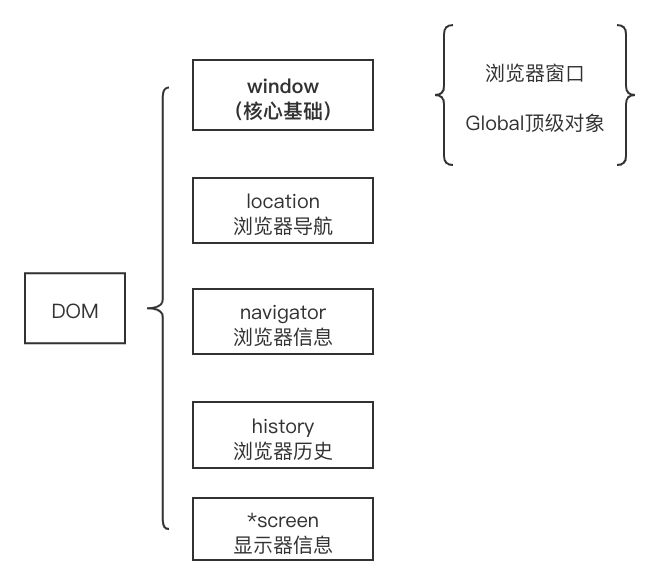
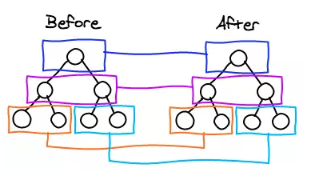

### lesson2（上）
BOM模型

---
#### js课程主要内容
**主题**：bom模型

- 浏览器对象模型
- window对象
- window——浏览器窗口对象
- window——global对象

---
1. 浏览器对象模型
BOM，Browser Object Model

浏览器功能对象，是使用JavaScript开发Web应用程序的核心。
window对象是BOM的核心和载体。

---
它们的关系如下：


---
2. window对象
浏览器的实例对象，表示一个包含DOM文档的窗口。

- ECMAScript 规定的Global对象
- 浏览器窗口的JavaScript接口，代表浏览器窗口和页面可见的区域

---
3. window——浏览器窗口对象

（1）窗口和像素
window对象上的尺寸显示api，如
- screen(Top|Left)
- inner(Width|Height)
- outer(Width|Height)
- client(Width|Height)
- page(X|Y)offset、scroll(X|Y)

---
window对象上操作窗口的api，如：
- move(To|By) （依据浏览器而定，可能被禁用部分或者全部禁用）
- scroll(To|By)
- resize(To|By)
- open|close

---
像素比
 window.devicePixelRatio

 1像素

 如果屏幕距离人眼是一臂长，则以这个角度计算的CSS像素大小约为1/96英寸，这个角度为0.0213°

问题

为了让低分辨率平板设备上12像素(CSS像素)的文字应该与高清4K屏幕下12像素(CSS像 素)的文字具有相同大小

---
正因为高分屏幕上单位区域内的像素点更多，就出现了像素比——不同像素密度的屏幕下就会有不同的缩放系数。

举个例子，对于分辨率从1920×1080转换为640×320的设备，比率值就是3。这样一来，12像素(CSS像素)的文字实际上就会用36像素的物理像素来显示。
 

---
（2）alert
同步执行的对话框，出现时网页代码停止执行，消失后网代码恢复执行。类似的还有，confirm，prompt。

有时候会用于调试代码。

---
（3）定时器
setTimeout延时器、循环执行setInterval

```js
setTimeout(()=>{
    //statement
},n)
// n表示,告诉JavaScript引擎在指定的毫秒数过后把任务添加到这个队列。
// 如果队列空，则会立即执行该代码。否则，等待前面执行完后执行
```

---
4. window——global对象

（1）Global对象
因为对象被复用为ECMAScript的 Global 对象，所以通过 var 声明的所有全局变量和函 对象的属性和方法。比如:
```js
var abc = 2021
abc         //2021
window.abc  //同样也是2021
```

---
（2）Dom
Dom是HTML和XML文档的编程接口。

DOM模型

用一个逻辑树来表示一个文档，树的每个分支的终点都是一个节点(node)，每个节点都包含着对象(objects)。


Dom API

更多接口内容，请参照链接：https://developer.mozilla.org/zh-CN/docs/Web/API/Document_Object_Model

---
思考一下：在vue中，有diff算法用于比对虚拟节点，更新差异点到真实Dom上去，这个过程是如何比对的？

下面一张图，可以帮助你思考（深度搜索遍历）

